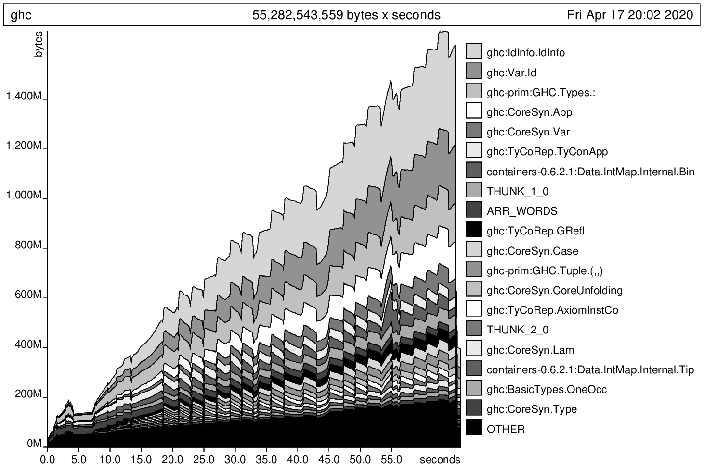

## -XNoDerivingVia GC Stats

```plaintext
  65,238,676,200 bytes allocated in the heap
  13,349,324,608 bytes copied during GC
   1,038,523,608 bytes maximum residency (22 sample(s))
      10,322,728 bytes maximum slop
             990 MB total memory in use (0 MB lost due to fragmentation)

                                     Tot time (elapsed)  Avg pause  Max pause
  Gen  0      7919 colls,  7882 par   174.418s  27.383s     0.0035s    0.1160s
  Gen  1        22 colls,    17 par   16.442s   1.697s     0.0772s    0.2675s

  Parallel GC work balance: 41.11% (serial 0%, perfect 100%)

  TASKS: 37 (1 bound, 36 peak workers (36 total), using -N12)

  SPARKS: 0 (0 converted, 0 overflowed, 0 dud, 0 GC'd, 0 fizzled)

  INIT    time    0.000s  (  0.000s elapsed)
  MUT     time   45.126s  ( 42.532s elapsed)
  GC      time  190.860s  ( 29.080s elapsed)
  EXIT    time    0.001s  (  0.008s elapsed)
  Total   time  235.987s  ( 71.620s elapsed)

  Alloc rate    1,445,698,412 bytes per MUT second

  Productivity  19.1% of total user, 59.4% of total elapsed
```

## -XDerivingVia GC Stats

```plaintext
  98,804,135,064 bytes allocated in the heap
  18,163,296,232 bytes copied during GC
   1,484,323,576 bytes maximum residency (22 sample(s))
      11,715,848 bytes maximum slop
            1415 MB total memory in use (0 MB lost due to fragmentation)

                                     Tot time (elapsed)  Avg pause  Max pause
  Gen  0     10414 colls, 10377 par   244.454s  38.339s     0.0037s    0.0930s
  Gen  1        22 colls,    17 par   21.327s   2.186s     0.0994s    0.3817s

  Parallel GC work balance: 40.22% (serial 0%, perfect 100%)

  TASKS: 38 (1 bound, 37 peak workers (37 total), using -N12)

  SPARKS: 0 (0 converted, 0 overflowed, 0 dud, 0 GC'd, 0 fizzled)

  INIT    time    0.000s  (  0.000s elapsed)
  MUT     time   63.641s  ( 60.166s elapsed)
  GC      time  265.780s  ( 40.525s elapsed)
  EXIT    time    0.002s  (  0.009s elapsed)
  Total   time  329.425s  (100.700s elapsed)

  Alloc rate    1,552,512,610 bytes per MUT second

  Productivity  19.3% of total user, 59.7% of total elapsed
```

## -XDerivingVia GC Stats with -h

```plaintext
  98,836,106,608 bytes allocated in the heap
 505,964,462,096 bytes copied during GC
   1,685,746,768 bytes maximum residency (628 sample(s))
      14,393,736 bytes maximum slop
            1607 MB total memory in use (0 MB lost due to fragmentation)

                                     Tot time (elapsed)  Avg pause  Max pause
  Gen  0      4060 colls,  4023 par   190.524s  30.964s     0.0076s    0.1490s
  Gen  1       628 colls,   623 par   4265.310s  373.021s     0.5940s    1.3825s

  Parallel GC work balance: 95.98% (serial 0%, perfect 100%)

  TASKS: 37 (1 bound, 36 peak workers (36 total), using -N12)

  SPARKS: 0 (0 converted, 0 overflowed, 0 dud, 0 GC'd, 0 fizzled)

  INIT    time    0.000s  (  0.001s elapsed)
  MUT     time   68.136s  ( 61.394s elapsed)
  GC      time  4455.835s  (403.985s elapsed)
  EXIT    time    0.000s  (  0.001s elapsed)
  Total   time  4523.971s  (465.380s elapsed)

  Alloc rate    1,450,566,564 bytes per MUT second

  Productivity   1.5% of total user, 13.2% of total elapsed
```



## Time

| Stage                          | -XNoDerivingVia Time | -XDerivingVia Time | Diff     |
| ------------------------------ | -------------------- | ------------------ | -------- |
| Parser 1                       | 0.017s               | 0.016s             | -0.001   |
| Renamer/typechecker 1          | 3.125s               | 5.311s             | +2.186s  |
| Desugar 1                      | 0.087s               | 0.118s             | +0.031s  |
| Simplifier 1                   | 7.23s                | 17.244s            | +10.014s |
| Specialise 1                   | 2.05s                | 17.417s            | +15.368s |
| Float out 1                    | 3.266s               | 6.115s             | +2.848s  |
| Simplifier 2                   | 32.137s              | 44.246s            | +12.109s |
| Simplifier 3                   | 60.641s              | 80.73s             | +20.089s |
| Simplifier 4                   | 57.245s              | 72.558s            | +15.313s |
| Float inwards 1                | 0.0s                 | 0.0s               | +0.0s    |
| Called arity analysis 1        | 0.0s                 | 0.0s               | +0.0s    |
| Simplifier 5                   | 60.659s              | 83.1s              | +22.441s |
| Demand analysis 1              | 4.949s               | 5.47s              | +0.521s  |
| Worker Wrapper binds 1         | 0.746s               | 1.874s             | +1.128s  |
| Simplifier 6                   | 63.48s               | 83.32s             | +19.839s |
| Exitification transformation 1 | 0.0s                 | 0.0s               | -0.0     |
| Float out 2                    | 18.701s              | 24.925s            | +6.224s  |
| Common sub-expression 1        | 0.0s                 | 0.0s               | +0.0s    |
| Float inwards 2                | 0.0s                 | 0.0s               | -0.0     |
| Simplifier 7                   | 63.734s              | 85.234s            | +21.501s |
| Demand analysis 2              | 3.877s               | 5.697s             | +1.82s   |
| CoreTidy 1                     | 0.967s               | 1.818s             | +0.851s  |
| CorePrep 1                     | 0.0s                 | 0.0s               | +0.0s    |
| CodeGen 1                      | 2.351s               | 4.799s             | +2.448s  |
| CorePrep 2                     | 0.0s                 | 0.0s               | +0.0s    |
| CodeGen 2                      | 2.332s               | 5.642s             | +3.31s   |

## Time, sorted by diff

| Stage                          | -XNoDerivingVia Time | -XDerivingVia Time | Diff     |
| ------------------------------ | -------------------- | ------------------ | -------- |
| Simplifier 5                   | 60.659s              | 83.1s              | +22.441s |
| Simplifier 7                   | 63.734s              | 85.234s            | +21.501s |
| Simplifier 3                   | 60.641s              | 80.73s             | +20.089s |
| Simplifier 6                   | 63.48s               | 83.32s             | +19.839s |
| Specialise 1                   | 2.05s                | 17.417s            | +15.368s |
| Simplifier 4                   | 57.245s              | 72.558s            | +15.313s |
| Simplifier 2                   | 32.137s              | 44.246s            | +12.109s |
| Simplifier 1                   | 7.23s                | 17.244s            | +10.014s |
| Float out 2                    | 18.701s              | 24.925s            | +6.224s  |
| CodeGen 2                      | 2.332s               | 5.642s             | +3.31s   |
| Float out 1                    | 3.266s               | 6.115s             | +2.848s  |
| CodeGen 1                      | 2.351s               | 4.799s             | +2.448s  |
| Renamer/typechecker 1          | 3.125s               | 5.311s             | +2.186s  |
| Demand analysis 2              | 3.877s               | 5.697s             | +1.82s   |
| Worker Wrapper binds 1         | 0.746s               | 1.874s             | +1.128s  |
| CoreTidy 1                     | 0.967s               | 1.818s             | +0.851s  |
| Demand analysis 1              | 4.949s               | 5.47s              | +0.521s  |
| Desugar 1                      | 0.087s               | 0.118s             | +0.031s  |
| Float inwards 1                | 0.0s                 | 0.0s               | +0.0s    |
| Called arity analysis 1        | 0.0s                 | 0.0s               | +0.0s    |
| CorePrep 1                     | 0.0s                 | 0.0s               | +0.0s    |
| CorePrep 2                     | 0.0s                 | 0.0s               | +0.0s    |
| Common sub-expression 1        | 0.0s                 | 0.0s               | +0.0s    |
| Float inwards 2                | 0.0s                 | 0.0s               | -0.0     |
| Exitification transformation 1 | 0.0s                 | 0.0s               | -0.0     |
| Parser 1                       | 0.017s               | 0.016s             | -0.001   |

## Allocation

| Stage                          | -XNoDerivingVia Allocation | -XDerivingVia Allocation | Diff         |
| ------------------------------ | -------------------------- | ------------------------ | ------------ |
| Parser 1                       | 8.557 MB                   | 7.957 MB                 | -0.599       |
| Renamer/typechecker 1          | 460.724 MB                 | 1094.351 MB              | +633.627 MB  |
| Desugar 1                      | 9.7 MB                     | 12.91 MB                 | +3.21 MB     |
| Simplifier 1                   | 1218.089 MB                | 2997.103 MB              | +1779.013 MB |
| Specialise 1                   | 1026.858 MB                | 9005.987 MB              | +7979.129 MB |
| Float out 1                    | 301.863 MB                 | 473.112 MB               | +171.249 MB  |
| Simplifier 2                   | 5030.54 MB                 | 7454.576 MB              | +2424.036 MB |
| Simplifier 3                   | 9911.664 MB                | 13496.51 MB              | +3584.845 MB |
| Simplifier 4                   | 8377.837 MB                | 11027.063 MB             | +2649.226 MB |
| Float inwards 1                | 0.013 MB                   | 0.013 MB                 | 0.0          |
| Called arity analysis 1        | 0.014 MB                   | 0.014 MB                 | 0.0          |
| Simplifier 5                   | 8481.667 MB                | 11402.184 MB             | +2920.517 MB |
| Demand analysis 1              | 1555.026 MB                | 2103.446 MB              | +548.42 MB   |
| Worker Wrapper binds 1         | 42.202 MB                  | 62.274 MB                | +20.072 MB   |
| Simplifier 6                   | 8916.586 MB                | 11586.541 MB             | +2669.955 MB |
| Exitification transformation 1 | 0.014 MB                   | 0.014 MB                 | 0.0          |
| Float out 2                    | 1565.291 MB                | 2197.848 MB              | +632.557 MB  |
| Common sub-expression 1        | 0.013 MB                   | 0.013 MB                 | 0.0          |
| Float inwards 2                | 0.013 MB                   | 0.013 MB                 | 0.0          |
| Simplifier 7                   | 8806.673 MB                | 11804.135 MB             | +2997.462 MB |
| Demand analysis 2              | 1436.256 MB                | 1989.824 MB              | +553.568 MB  |
| CoreTidy 1                     | 153.302 MB                 | 208.19 MB                | +54.888 MB   |
| CorePrep 1                     | 0.011 MB                   | 0.011 MB                 | 0.0          |
| CodeGen 1                      | 1354.115 MB                | 2218.74 MB               | +864.625 MB  |
| CorePrep 2                     | 0.011 MB                   | 0.011 MB                 | 0.0          |
| CodeGen 2                      | 1420.486 MB                | 2328.31 MB               | +907.824 MB  |

## Allocation, sorted by diff

| Stage                          | -XNoDerivingVia Allocation | -XDerivingVia Allocation | Diff         |
| ------------------------------ | -------------------------- | ------------------------ | ------------ |
| Specialise 1                   | 1026.858 MB                | 9005.987 MB              | +7979.129 MB |
| Simplifier 3                   | 9911.664 MB                | 13496.51 MB              | +3584.845 MB |
| Simplifier 7                   | 8806.673 MB                | 11804.135 MB             | +2997.462 MB |
| Simplifier 5                   | 8481.667 MB                | 11402.184 MB             | +2920.517 MB |
| Simplifier 6                   | 8916.586 MB                | 11586.541 MB             | +2669.955 MB |
| Simplifier 4                   | 8377.837 MB                | 11027.063 MB             | +2649.226 MB |
| Simplifier 2                   | 5030.54 MB                 | 7454.576 MB              | +2424.036 MB |
| Simplifier 1                   | 1218.089 MB                | 2997.103 MB              | +1779.013 MB |
| CodeGen 2                      | 1420.486 MB                | 2328.31 MB               | +907.824 MB  |
| CodeGen 1                      | 1354.115 MB                | 2218.74 MB               | +864.625 MB  |
| Renamer/typechecker 1          | 460.724 MB                 | 1094.351 MB              | +633.627 MB  |
| Float out 2                    | 1565.291 MB                | 2197.848 MB              | +632.557 MB  |
| Demand analysis 2              | 1436.256 MB                | 1989.824 MB              | +553.568 MB  |
| Demand analysis 1              | 1555.026 MB                | 2103.446 MB              | +548.42 MB   |
| Float out 1                    | 301.863 MB                 | 473.112 MB               | +171.249 MB  |
| CoreTidy 1                     | 153.302 MB                 | 208.19 MB                | +54.888 MB   |
| Worker Wrapper binds 1         | 42.202 MB                  | 62.274 MB                | +20.072 MB   |
| Desugar 1                      | 9.7 MB                     | 12.91 MB                 | +3.21 MB     |
| Float inwards 1                | 0.013 MB                   | 0.013 MB                 | 0.0          |
| Called arity analysis 1        | 0.014 MB                   | 0.014 MB                 | 0.0          |
| Exitification transformation 1 | 0.014 MB                   | 0.014 MB                 | 0.0          |
| Common sub-expression 1        | 0.013 MB                   | 0.013 MB                 | 0.0          |
| Float inwards 2                | 0.013 MB                   | 0.013 MB                 | 0.0          |
| CorePrep 1                     | 0.011 MB                   | 0.011 MB                 | 0.0          |
| CorePrep 2                     | 0.011 MB                   | 0.011 MB                 | 0.0          |
| Parser 1                       | 8.557 MB                   | 7.957 MB                 | -0.599       |

