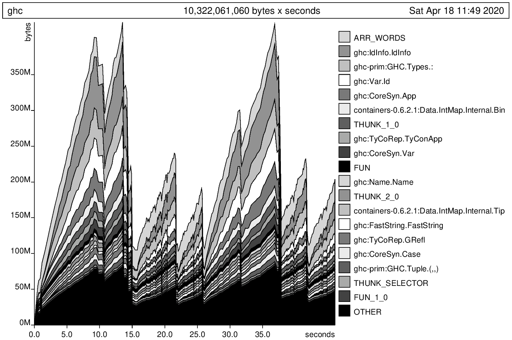

## -XNoDerivingVia GC Stats

```plaintext
  63,580,560,024 bytes allocated in the heap
  12,508,100,280 bytes copied during GC
     406,780,976 bytes maximum residency (33 sample(s))
       6,427,600 bytes maximum slop
             387 MB total memory in use (0 MB lost due to fragmentation)

                                     Tot time (elapsed)  Avg pause  Max pause
  Gen  0      9357 colls,  9302 par   151.905s  22.715s     0.0024s    0.0363s
  Gen  1        33 colls,    28 par   14.887s   1.523s     0.0461s    0.1048s

  Parallel GC work balance: 40.42% (serial 0%, perfect 100%)

  TASKS: 38 (1 bound, 37 peak workers (37 total), using -N12)

  SPARKS: 0 (0 converted, 0 overflowed, 0 dud, 0 GC'd, 0 fizzled)

  INIT    time    0.000s  (  0.000s elapsed)
  MUT     time   50.173s  ( 30.503s elapsed)
  GC      time  166.792s  ( 24.238s elapsed)
  EXIT    time    0.002s  (  0.009s elapsed)
  Total   time  216.968s  ( 54.750s elapsed)

  Alloc rate    1,267,222,934 bytes per MUT second

  Productivity  23.1% of total user, 55.7% of total elapsed
```

## -XNoDerivingVia GC Stats with -h

```plaintext
  63,538,981,352 bytes allocated in the heap
  56,949,032,704 bytes copied during GC
     424,328,720 bytes maximum residency (290 sample(s))
       6,232,664 bytes maximum slop
             404 MB total memory in use (0 MB lost due to fragmentation)

                                     Tot time (elapsed)  Avg pause  Max pause
  Gen  0      3312 colls,  3258 par   134.241s  20.660s     0.0062s    0.0528s
  Gen  1       290 colls,   285 par   432.273s  37.178s     0.1282s    0.3101s

  Parallel GC work balance: 86.77% (serial 0%, perfect 100%)

  TASKS: 38 (1 bound, 37 peak workers (37 total), using -N12)

  SPARKS: 0 (0 converted, 0 overflowed, 0 dud, 0 GC'd, 0 fizzled)

  INIT    time    0.000s  (  0.000s elapsed)
  MUT     time   46.477s  ( 29.158s elapsed)
  GC      time  566.515s  ( 57.838s elapsed)
  EXIT    time    0.003s  (  0.004s elapsed)
  Total   time  612.995s  ( 87.000s elapsed)

  Alloc rate    1,367,096,849 bytes per MUT second

  Productivity   7.6% of total user, 33.5% of total elapsed
```




## -XDerivingVia GC Stats

```plaintext
  87,996,517,096 bytes allocated in the heap
  16,946,626,560 bytes copied during GC
     548,909,120 bytes maximum residency (35 sample(s))
       6,749,120 bytes maximum slop
             523 MB total memory in use (0 MB lost due to fragmentation)

                                     Tot time (elapsed)  Avg pause  Max pause
  Gen  0     10606 colls, 10549 par   199.264s  30.222s     0.0028s    0.0563s
  Gen  1        35 colls,    30 par   20.379s   2.016s     0.0576s    0.1676s

  Parallel GC work balance: 40.94% (serial 0%, perfect 100%)

  TASKS: 38 (1 bound, 37 peak workers (37 total), using -N12)

  SPARKS: 0 (0 converted, 0 overflowed, 0 dud, 0 GC'd, 0 fizzled)

  INIT    time    0.000s  (  0.000s elapsed)
  MUT     time   64.916s  ( 40.979s elapsed)
  GC      time  219.642s  ( 32.238s elapsed)
  EXIT    time    0.002s  (  0.003s elapsed)
  Total   time  284.561s  ( 73.220s elapsed)

  Alloc rate    1,355,542,492 bytes per MUT second

  Productivity  22.8% of total user, 56.0% of total elapsed
```

## -XDerivingVia GC Stats with -h

```plaintext
  88,005,877,296 bytes allocated in the heap
  97,338,035,968 bytes copied during GC
     550,109,160 bytes maximum residency (392 sample(s))
       7,540,568 bytes maximum slop
             524 MB total memory in use (0 MB lost due to fragmentation)

                                     Tot time (elapsed)  Avg pause  Max pause
  Gen  0      3830 colls,  3773 par   179.435s  27.657s     0.0072s    0.0709s
  Gen  1       392 colls,   387 par   758.008s  64.808s     0.1653s    0.3934s

  Parallel GC work balance: 89.50% (serial 0%, perfect 100%)

  TASKS: 38 (1 bound, 37 peak workers (37 total), using -N12)

  SPARKS: 0 (0 converted, 0 overflowed, 0 dud, 0 GC'd, 0 fizzled)

  INIT    time    0.000s  (  0.001s elapsed)
  MUT     time   62.316s  ( 39.481s elapsed)
  GC      time  937.443s  ( 92.465s elapsed)
  EXIT    time    0.004s  (  0.004s elapsed)
  Total   time  999.763s  (131.950s elapsed)

  Alloc rate    1,412,255,717 bytes per MUT second

  Productivity   6.2% of total user, 29.9% of total elapsed
```


